# Claude Code Best (CCB) 架构导读

> 本文档详细解析 CCB 项目的整体架构、核心类关系、数据结构、调用流程和关键算法。
> CCB 是一个开源的 Claude Code CLI 工具实现，支持多种高级特性如 MCP、群控技术、远程控制等。

## 📋 目录

- [项目概述](#项目概述)
- [整体架构图](#整体架构图)
- [核心模块依赖关系](#核心模块依赖关系)
- [子系统详解](#子系统详解)
  - [1. 命令系统 (Commands)](#1-命令系统-commands)
  - [2. 工具系统 (Tools)](#2-工具系统-tools)
  - [3. 状态管理系统 (State)](#3-状态管理系统-state)
  - [4. 查询引擎 (QueryEngine)](#4-查询引擎-queryengine)
  - [5. 任务系统 (Tasks)](#5-任务系统-tasks)
  - [6. MCP 服务 (MCP)](#6-mcp-服务-mcp)
  - [7. API 服务 (API)](#7-api-服务-api)
  - [8. 插件系统 (Plugins)](#8-插件系统-plugins)
  - [9. REPL 系统](#9-repl-系统)
  - [10. 认证系统 (Auth)](#10-认证系统-auth)
  - [11. 配置系统 (Config)](#11-配置系统-config)
- [类与类型体系](#类与类型体系)
- [数据流转图](#数据流转图)
- [关键算法解析](#关键算法解析)

---

## 项目概述

### 什么是 CCB

**CCB (Claude Code Best)** 是一个开源的 Claude Code CLI 工具逆向工程/开源实现项目。目标是为开发者提供与官方 Claude Code 功能相似的开源解决方案，实现技术普惠。

### 核心特性

| 特性 | 说明 |
|------|------|
| **Claude 群控技术** | Pipe IPC 多实例协作，同机 main/sub 自动编排 |
| **ACP 协议支持** | 支持接入 Zed、Cursor 等 IDE |
| **Remote Control** | Docker 自托管远程界面 |
| **Langfuse 监控** | 企业级 Agent 监控 |
| **Web Search** | 内置网页搜索工具 |
| **Poor Mode** | 穷鬼模式，大幅度减少并发请求 |
| **Voice Mode** | 语音输入支持 |

### 技术栈

- **运行时**: Bun >= 1.3.11
- **语言**: TypeScript + React (UI组件)
- **包管理**: Bun
- **构建工具**: Biome (代码规范)

---

## 整体架构图

### 系统架构分层

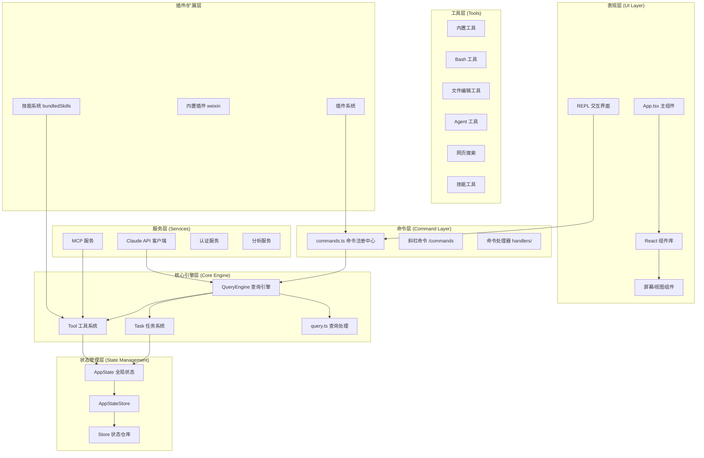

### 启动流程

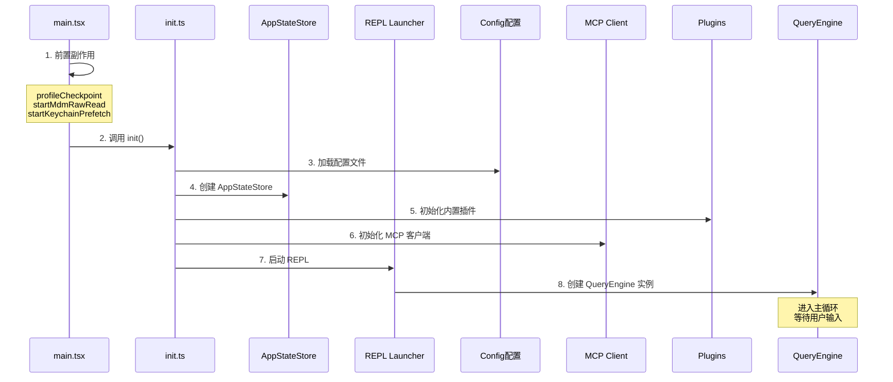

---

## 核心模块依赖关系

### 模块依赖图

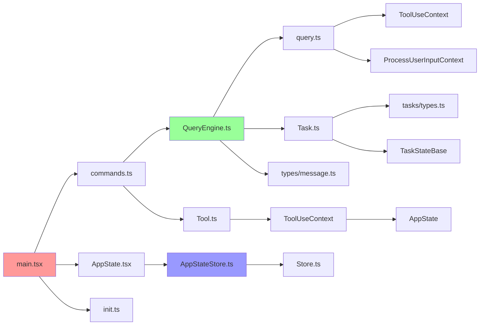

---

## 子系统详解

### 1. 命令系统 (Commands)

命令系统是 CCB 的交互入口，负责注册和处理所有斜杠命令（如 `/diff`, `/help`, `/mcp` 等）。

#### 架构图

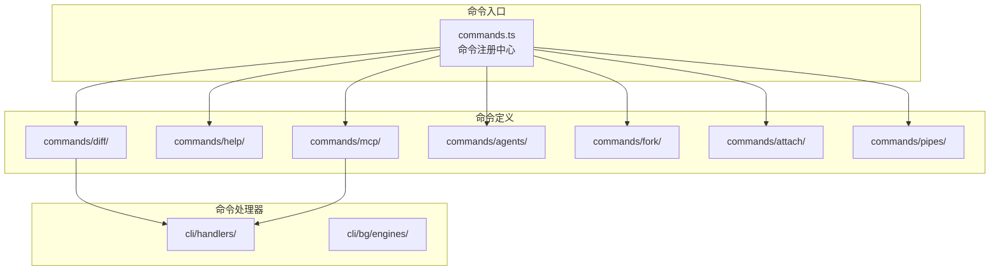

#### 核心文件

| 文件路径 | 说明 |
|---------|------|
| [commands.ts](file:///e:/Code/ccb/src/commands.ts) | 命令注册中心，导入所有命令并统一导出 |
| [cli/handlers/](file:///e:/Code/ccb/src/cli/handlers/) | 命令处理器目录 |
| [commands/diff/](file:///e:/Code/ccb/src/commands/diff/) | Diff 命令实现 |
| [commands/mcp/](file:///e:/Code/ccb/src/commands/mcp/) | MCP 命令实现 |
| [commands/agents/](file:///e:/Code/ccb/src/commands/agents/) | Agent 管理命令 |
| [commands/fork/](file:///e:/Code/ccb/src/commands/fork/) | Fork 子 Agent 命令 |

#### 关键代码片段

```typescript
// commands.ts - 命令注册示例
import diff from './commands/diff/index.js'
import help from './commands/help/index.js'
import mcp from './commands/mcp/index.js'
import agents from './commands/agents/index.js'
// ... 更多命令导入

// 条件导入 (特性开关)
const voiceCommand = feature('VOICE_MODE')
  ? require('./commands/voice/index.js').default
  : null
const pipesCmd = feature('UDS_INBOX')
  ? require('./commands/pipes/index.js').default
  : null
```

#### 命令类型

| 命令 | 功能 | 代码位置 |
|------|------|----------|
| `/diff` | 显示 Git 差异 | commands/diff/ |
| `/help` | 显示帮助信息 | commands/help/ |
| `/mcp` | MCP 服务器管理 | commands/mcp/ |
| `/agents` | Agent 管理 | commands/agents/ |
| `/fork` | Fork 子 Agent | commands/fork/ |
| `/attach` | 附加到会话 | commands/attach/ |
| `/pipes` | Pipe IPC 管理 | commands/pipes/ |
| `/voice` | 语音模式 | commands/voice/ |

#### 命令执行流程

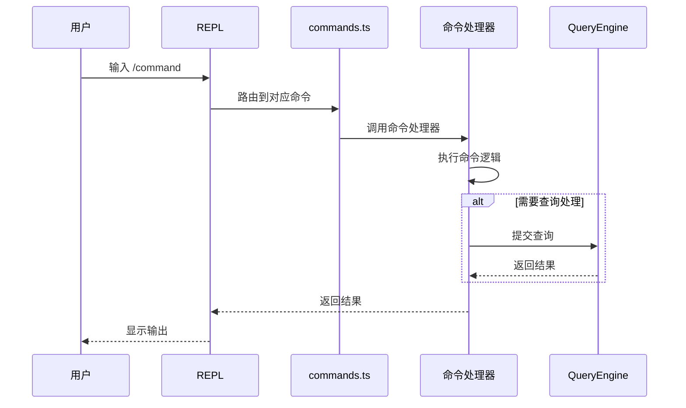

---

### 2. 工具系统 (Tools)

工具系统是 CCB 的核心能力扩展，允许 Claude 通过工具与外部系统交互。

#### 架构图

```mermaid
classDiagram
    class Tool {
        <<接口>>
        +name: string
        +inputSchema: ZodType
        +call(): Promise~ToolResult~
        +description(): Promise~string~
        +isConcurrencySafe(): boolean
        +isReadOnly(): boolean
    }

    class BashTool {
        +name: 'Bash'
        +isConcurrencySafe: false
        +isReadOnly: false
        +call(): 执行shell命令
    }

    class FileEditTool {
        +name: 'Edit'
        +isConcurrencySafe: false
        +isReadOnly: false
        +call(): 编辑文件内容
    }

    class FileReadTool {
        +name: 'Read'
        +isConcurrencySafe: true
        +isReadOnly: true
        +call(): 读取文件内容
    }

    class FileWriteTool {
        +name: 'Write'
        +isConcurrencySafe: false
        +isReadOnly: false
        +call(): 写入文件
    }

    class GlobTool {
        +name: 'Glob'
        +isConcurrencySafe: true
        +isReadOnly: true
        +call(): 文件模式匹配
    }

    class WebSearchTool {
        +name: 'WebSearch'
        +isConcurrencySafe: true
        +isReadOnly: true
        +call(): 网页搜索
    }

    class AgentTool {
        +name: 'Agent'
        +isConcurrencySafe: false
        +isReadOnly: false
        +call(): 启动子Agent
    }

    class SkillTool {
        +name: 'Skill'
        +isConcurrencySafe: false
        +isReadOnly: false
        +call(): 执行技能
    }

    class TaskStopTool {
        +name: 'TaskStop'
        +isConcurrencySafe: true
        +isReadOnly: false
        +call(): 停止任务
    }

    class WebFetchTool {
        +name: 'WebFetch'
        +isConcurrencySafe: true
        +isReadOnly: true
        +call(): 获取网页内容
    }

    class GrepTool {
        +name: 'Grep'
        +isConcurrencySafe: true
        +isReadOnly: true
        +call(): 文本搜索
    }

    Tool <|.. BashTool
    Tool <|.. FileEditTool
    Tool <|.. FileReadTool
    Tool <|.. FileWriteTool
    Tool <|.. GlobTool
    Tool <|.. WebSearchTool
    Tool <|.. AgentTool
    Tool <|.. SkillTool
    Tool <|.. TaskStopTool
    Tool <|.. WebFetchTool
    Tool <|.. GrepTool
```

#### 工具注册流程

```mermaid
flowchart TB
    A[tools.ts] --> B[导入内置工具]
    B --> C[BashTool]
    B --> D[FileEditTool]
    B --> E[FileReadTool]
    B --> F[GlobTool]
    B --> G[AgentTool]
    B --> H[WebSearchTool]

    A --> I{特性开关}
    I -->|VOICE_MODE| J[Voice工具]
    I -->|WEB_BROWSER_TOOL| K[WebBrowserTool]
    I -->|WORKFLOW_SCRIPTS| L[WorkflowTool]
    I -->|UDS_INBOX| M[ListPeersTool]

    C --> N[getTools 函数]
    D --> N
    E --> N
    F --> N
    G --> N
    H --> N
    I --> N
    N --> O[返回 Tools[]]
```

#### 核心文件

| 文件路径 | 说明 |
|---------|------|
| [tools.ts](file:///e:/Code/ccb/src/tools.ts) | 工具注册中心 |
| [Tool.ts](file:///e:/Code/ccb/src/Tool.ts) | Tool 接口定义 |
| [types/tools.ts](file:///e:/Code/ccb/src/types/tools.ts) | 工具相关类型 |

#### Tool 接口定义

```typescript
// Tool.ts - 核心接口
export type Tool<
  Input extends AnyObject = AnyObject,
  Output = unknown,
  P extends ToolProgressData = ToolProgressData,
> = {
  readonly name: string
  readonly inputSchema: Input
  readonly inputJSONSchema?: ToolInputJSONSchema
  outputSchema?: z.ZodType<unknown>
  aliases?: string[]
  searchHint?: string

  // 核心方法
  call(
    args: z.infer<Input>,
    context: ToolUseContext,
    canUseTool: CanUseToolFn,
    parentMessage: AssistantMessage,
    onProgress?: ToolCallProgress<P>,
  ): Promise<ToolResult<Output>>

  description(
    input: z.infer<Input>,
    options: { isNonInteractiveSession: boolean; toolPermissionContext: ToolPermissionContext; tools: Tools },
  ): Promise<string>

  // 查询方法
  isConcurrencySafe(input: z.infer<Input>): boolean
  isReadOnly(input: z.infer<Input>): boolean
  isEnabled(): boolean
  isDestructive?(input: z.infer<Input>): boolean
  isSearchOrReadCommand?(input: z.infer<Input>): { isSearch: boolean; isRead: boolean; isList?: boolean }
}
```

#### 工具执行上下文 (ToolUseContext)

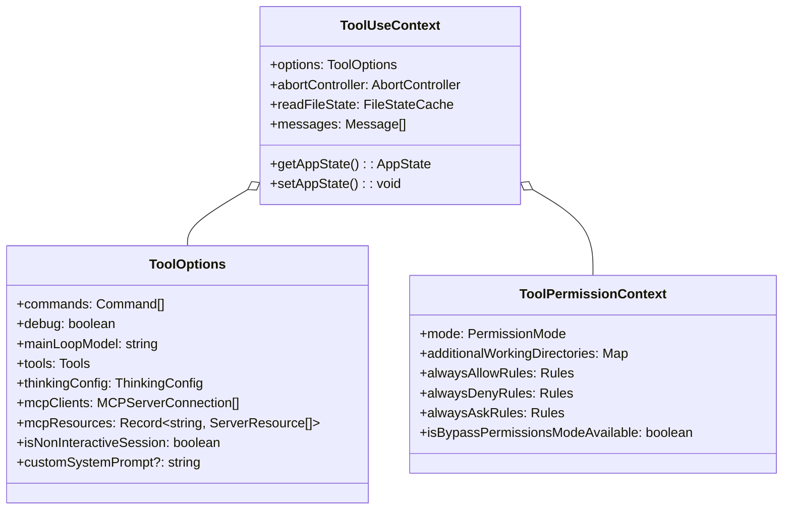

---

### 工具详细实现

#### 1. 文件操作工具

##### BashTool - 命令行执行工具

**功能说明**：执行 shell 命令，支持交互式和非交互式模式。

**设计难点**：
- 需要处理长时间运行的命令
- 需要支持命令中断
- 需要捕获标准输出和错误输出

**执行流程**：

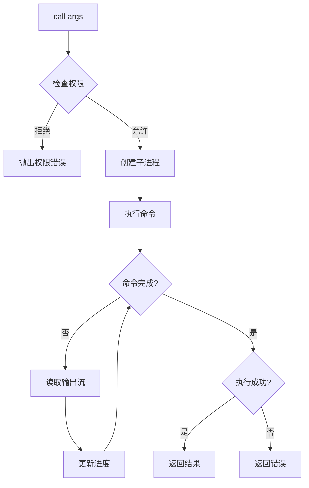

**核心代码结构**：

```typescript
class BashTool {
  name = 'Bash'
  
  call(args, context, canUseTool, parentMessage, onProgress) {
    // 1. 权限检查
    // 2. 创建子进程执行命令
    // 3. 流式读取输出
    // 4. 处理命令终止
  }
  
  isConcurrencySafe() { return false }
  isReadOnly() { return false }
}
```

**输入输出示例**：

| 输入 | 输出 |
|------|------|
| `{ command: "ls -la", cwd: "/home" }` | `{ type: "tool_result", content: "total 48..." }` |

---

##### FileReadTool - 文件读取工具

**功能说明**：读取指定文件内容，支持大文件截断和编码处理。

**设计难点**：
- 大文件处理（避免内存溢出）
- 编码检测和转换
- 文件路径安全检查

**执行流程**：

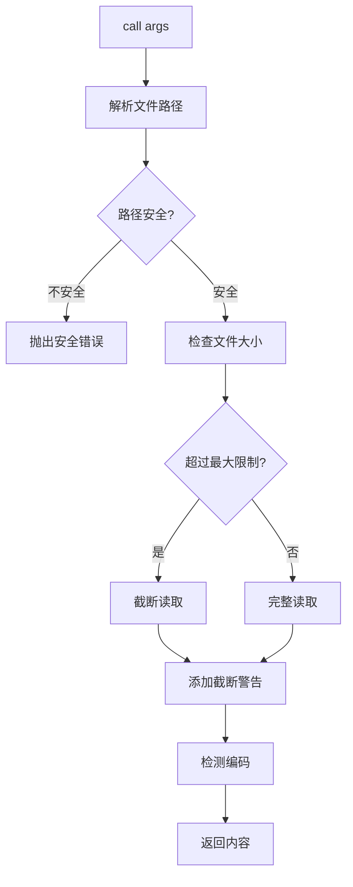

**关键设计**：

```typescript
// 文件大小限制处理
const MAX_FILE_SIZE = 1024 * 1024 * 5 // 5MB
if (fileSize > MAX_FILE_SIZE) {
  content = await readFile(path, { length: MAX_FILE_SIZE })
  content += '\n\n[文件已截断，仅显示前5MB]'
}
```

---

##### FileEditTool - 文件编辑工具

**功能说明**：对文件进行增量编辑，支持插入、替换和删除操作。

**设计难点**：
- 精确的文本定位
- 编辑冲突处理
- 撤销支持

**执行流程**：

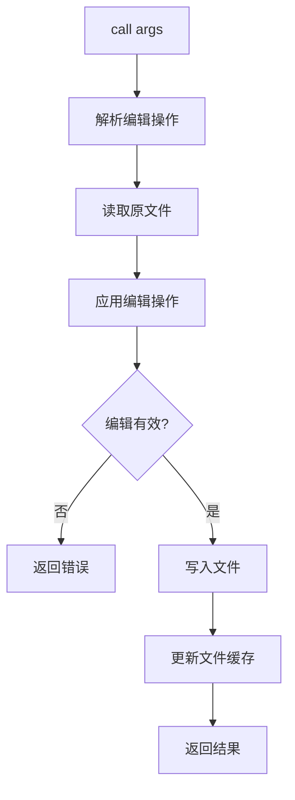

**编辑操作类型**：

| 操作类型 | 说明 | 示例 |
|---------|------|------|
| insert | 在指定位置插入文本 | `{ type: "insert", at: 100, text: "new content" }` |
| replace | 替换指定范围文本 | `{ type: "replace", start: 100, end: 150, text: "new content" }` |
| delete | 删除指定范围文本 | `{ type: "delete", start: 100, end: 150 }` |

---

##### FileWriteTool - 文件写入工具

**功能说明**：创建或覆盖文件内容。

**设计难点**：
- 文件创建权限检查
- 父目录自动创建
- 备份机制

**执行流程**：

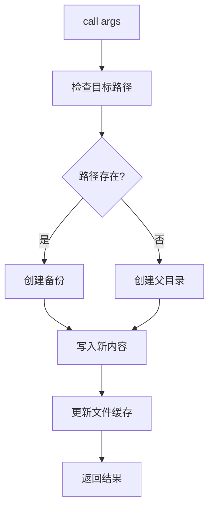

---

##### GlobTool - 文件模式匹配工具

**功能说明**：根据 glob 模式匹配文件列表。

**设计难点**：
- 高效的目录遍历
- 模式匹配优化
- 隐藏文件过滤

**执行流程**：

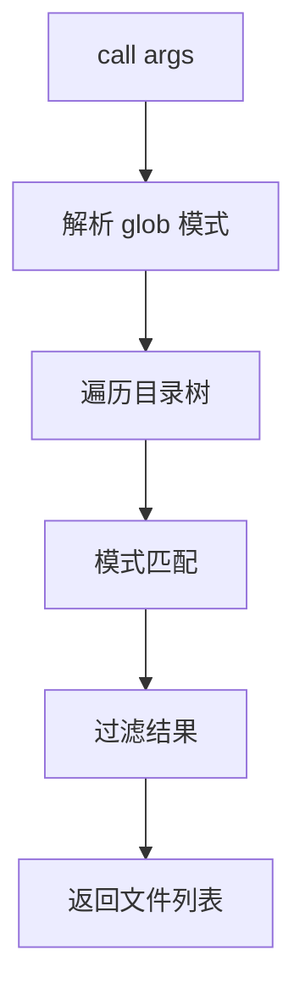

---

##### GrepTool - 文本搜索工具

**功能说明**：在文件中搜索指定模式。

**设计难点**：
- 正则表达式性能优化
- 多文件并行搜索
- 结果高亮显示

**执行流程**：

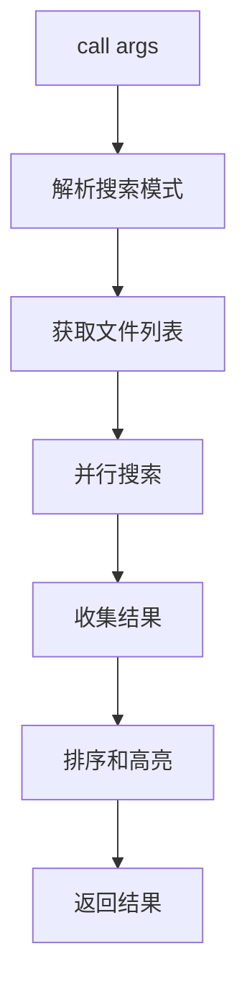

---

#### 2. 网络工具

##### WebSearchTool - 网页搜索工具

**功能说明**：执行网络搜索，获取搜索结果。

**设计难点**：
- 搜索 API 集成
- 结果摘要生成
- 多搜索源支持

**执行流程**：

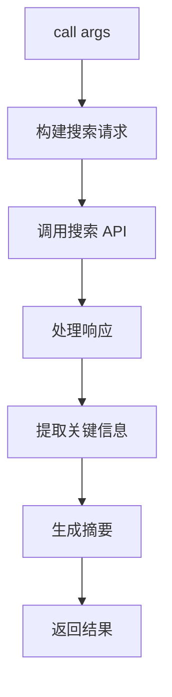

---

##### WebFetchTool - 网页内容获取工具

**功能说明**：获取指定 URL 的网页内容。

**设计难点**：
- HTML 解析和清理
- JavaScript 渲染支持
- 反爬机制应对

**执行流程**：

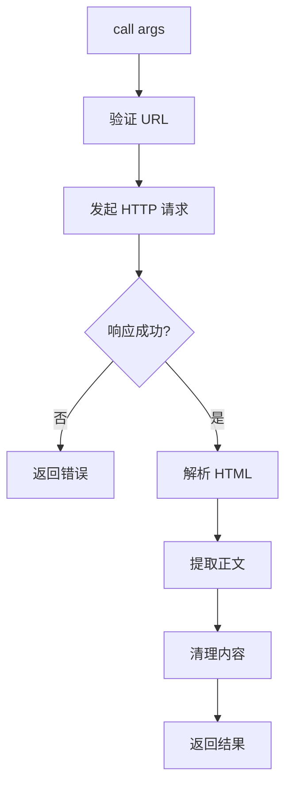

---

#### 3. Agent 工具

##### AgentTool - 子Agent启动工具

**功能说明**：启动一个新的子 Agent 会话。

**设计难点**：
- Agent 生命周期管理
- 进程间通信
- 资源隔离

**执行流程**：

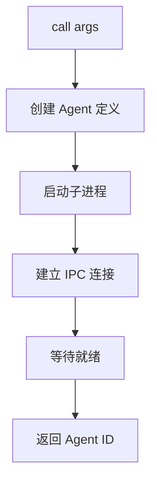

**Agent 类型**：

| 类型 | 说明 |
|------|------|
| local | 本地子进程 Agent |
| remote | 远程 Agent |
| ephemeral | 临时 Agent |

---

##### Task 系列工具

**功能说明**：任务管理工具集，包括创建、停止、查询任务。

**任务状态机**：

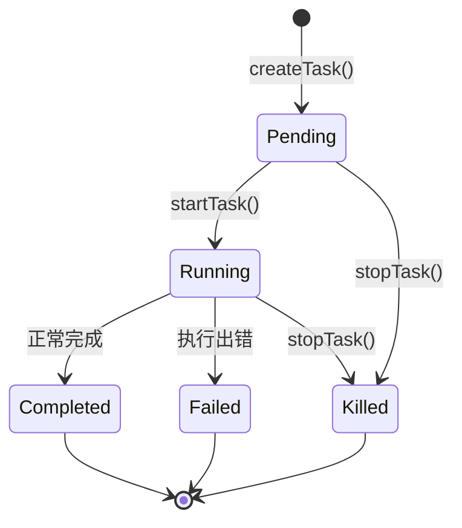

**工具协作关系**：

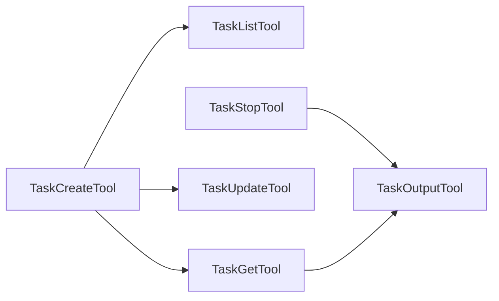

---

#### 4. 技能工具

##### SkillTool - 技能执行工具

**功能说明**：执行预定义的技能脚本。

**设计难点**：
- 技能发现和加载
- 技能参数验证
- 技能依赖管理

**执行流程**：

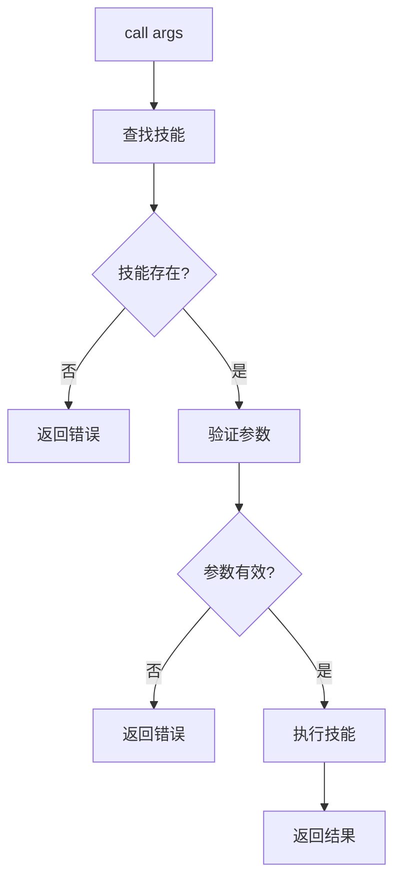

**技能分类**：

| 分类 | 说明 | 示例 |
|------|------|------|
| code | 代码相关技能 | 代码生成、重构 |
| analysis | 分析技能 | 代码审查、安全扫描 |
| automation | 自动化技能 | CI/CD 配置、部署 |

---

##### TodoWriteTool - Todo 管理工具

**功能说明**：管理任务清单。

**数据结构**：

```mermaid
classDiagram
    class TodoItem {
        +id: string
        +content: string
        +status: "pending" | "in_progress" | "completed"
        +priority: "high" | "medium" | "low"
        +createdAt: Date
        +updatedAt: Date
    }
    
    class TodoList {
        +items: TodoItem[]
        +add(item): void
        +remove(id): void
        +update(id, updates): void
        +filter(status): TodoItem[]
    }
```

---

#### 5. 开发工具

##### LSPTool - LSP 集成工具

**功能说明**：与 LSP 服务器交互，提供代码补全、定义跳转等功能。

**设计难点**：
- LSP 协议实现
- 异步请求处理
- 错误恢复机制

**LSP 协议流程**：

```mermaid
sequenceDiagram
    participant Client as LSPTool
    participant Server as LSPServer
    
    Client->>Server: initialize
    Server-->>Client: initialized
    
    Client->>Server: textDocument/completion
    Server-->>Client: CompletionList
    
    Client->>Server: textDocument/definition
    Server-->>Client: Location[]
```

---

##### ConfigTool - 配置管理工具

**功能说明**：管理 CCB 配置设置。

**配置层级**：

```mermaid
flowchart TB
    A[命令行参数] --> B[环境变量]
    B --> C[配置文件]
    C --> D[默认值]
    
    E[获取配置] --> F{命令行参数存在?}
    F -->|是| G[返回命令行参数]
    F -->|否| H{环境变量存在?}
    H -->|是| I[返回环境变量]
    H -->|否| J{配置文件存在?}
    J -->|是| K[返回配置文件值]
    J -->|否| L[返回默认值]
```

---

#### 6. MCP 工具

##### ListMcpResourcesTool / ReadMcpResourceTool

**功能说明**：访问 MCP 服务器提供的资源。

**MCP 协议架构**：

```mermaid
flowchart TB
    subgraph "CCB 客户端"
        A[ListMcpResourcesTool]
        B[ReadMcpResourceTool]
    end
    
    subgraph "MCP 服务器"
        C[资源管理器]
        D[工具注册表]
    end
    
    A --> C
    B --> C
    C --> D
```

**执行流程**：

```mermaid
sequenceDiagram
    participant Tool as MCP工具
    participant Client as MCPClient
    participant Server as MCPServer
    
    Tool->>Client: listResources()
    Client->>Server: JSON-RPC 请求
    Server-->>Client: 资源列表
    Client-->>Tool: 返回资源
    
    Tool->>Client: readResource(id)
    Client->>Server: JSON-RPC 请求
    Server-->>Client: 资源内容
    Client-->>Tool: 返回内容
```

---

#### 7. 工具注册与过滤流程

**完整的工具注册流程**：

```mermaid
flowchart TB
    A[工具注册入口] --> B[导入基础工具]
    B --> C[条件导入特性工具]
    
    C --> D{检查环境变量}
    D -->|CLAUDE_CODE_SIMPLE| E[返回简化工具集]
    D -->|否则| F[获取全部工具]
    
    F --> G[过滤拒绝规则]
    G --> H{REPL模式?}
    H -->|是| I[过滤REPL专用工具]
    H -->|否| J[继续]
    
    I --> K[检查isEnabled状态]
    J --> K
    
    K --> L[返回最终工具列表]
```

**工具分类汇总**：

| 类别 | 工具名称 | 并发安全 | 只读 |
|------|---------|---------|------|
| 文件操作 | BashTool | ❌ | ❌ |
| 文件操作 | FileReadTool | ✅ | ✅ |
| 文件操作 | FileEditTool | ❌ | ❌ |
| 文件操作 | FileWriteTool | ❌ | ❌ |
| 文件操作 | GlobTool | ✅ | ✅ |
| 文件操作 | GrepTool | ✅ | ✅ |
| 网络 | WebSearchTool | ✅ | ✅ |
| 网络 | WebFetchTool | ✅ | ✅ |
| Agent | AgentTool | ❌ | ❌ |
| Agent | TaskCreateTool | ❌ | ❌ |
| Agent | TaskStopTool | ✅ | ❌ |
| Agent | TaskOutputTool | ✅ | ✅ |
| 技能 | SkillTool | ❌ | ❌ |
| 技能 | TodoWriteTool | ❌ | ❌ |
| 开发 | LSPTool | ❌ | ✅ |
| 开发 | ConfigTool | ✅ | ✅ |
| MCP | ListMcpResourcesTool | ✅ | ✅ |
| MCP | ReadMcpResourceTool | ✅ | ✅ |

---

### 3. 状态管理系统 (State)

状态管理系统使用 React Context + useSyncExternalStore 模式，提供类型安全的全局状态访问。

#### 架构图

```mermaid
graph TB
    subgraph "React Context 层级"
        AppStateProvider["AppStateProvider"]
        VoiceProvider["VoiceProvider (条件)"]
        MailboxProvider["MailboxProvider"]
    end

    subgraph "状态仓库"
        AppStateStore["AppStateStore"]
        Store["Store <T> (Zustand风格)"]
    end

    subgraph "状态定义"
        AppState["AppState 类型"]
        Settings["SettingsJson"]
        TaskState["TaskState"]
        MCPState["MCPState"]
    end

    subgraph "消费Hooks"
        useAppState["useAppState(selector)"]
        useSetAppState["useSetAppState()"]
        useAppStateStore["useAppStateStore()"]
    end

    AppStateProvider --> VoiceProvider
    VoiceProvider --> MailboxProvider
    AppStateProvider --> AppStateStore
    AppStateStore --> Store
    Store --> AppState

    AppState --> Settings
    AppState --> TaskState
    AppState --> MCPState

    useAppState ..> AppStateStore
    useSetAppState ..> AppStateStore
```

#### 核心文件

| 文件路径 | 说明 |
|---------|------|
| [state/AppState.tsx](file:///e:/Code/ccb/src/state/AppState.tsx) | AppState 类型定义 |
| [state/AppStateStore.ts](file:///e:/Code/ccb/src/state/AppStateStore.ts) | React Context Provider |
| [state/store.ts](file:///e:/Code/ccb/src/state/store.ts) | Zustand 风格 Store |
| [state/selectors.ts](file:///e:/Code/ccb/src/state/selectors.ts) | 状态选择器 |

#### AppState 结构

```typescript
// AppState.tsx - 全局状态类型
export type AppState = DeepImmutable<{
  // 设置相关
  settings: SettingsJson
  verbose: boolean
  mainLoopModel: ModelSetting

  // UI 状态
  statusLineText: string | undefined
  expandedView: 'none' | 'tasks' | 'teammates'
  footerSelection: FooterItem | null
  spinnerTip?: string

  // 任务状态
  tasks: { [taskId: string]: TaskState }
  foregroundedTaskId?: string

  // MCP 状态
  mcp: {
    clients: MCPServerConnection[]
    tools: Tool[]
    commands: Command[]
    resources: Record<string, ServerResource[]>
    pluginReconnectKey: number
  }

  // 插件状态
  plugins: {
    enabled: LoadedPlugin[]
    disabled: LoadedPlugin[]
    commands: Command[]
    errors: PluginError[]
    needsRefresh: boolean
  }

  // 工具权限
  toolPermissionContext: ToolPermissionContext

  // 推测执行状态
  speculation: SpeculationState

  // 文件历史
  fileHistory: FileHistoryState
}>
```

#### 状态更新流程

```mermaid
sequenceDiagram
    participant Component as React组件
    participant Hook as useAppState/useSetAppState
    participant Store as AppStateStore
    participant AppState as AppState

    Note over Component: 读取状态
    Component->>Hook: useAppState(selector)
    Hook->>Store: store.subscribe(callback)
    Store-->>Hook: 返回当前状态
    Hook-->>Component: 返回选中状态

    Note over Component: 更新状态
    Component->>Hook: setAppState(updater)
    Hook->>Store: store.setState(updater)
    Store->>Store: 计算新状态
    Store-->>Hook: 通知变更
    Hook-->>Component: 触发重渲染
```

---

### 4. 查询引擎 (QueryEngine)

QueryEngine 是 CCB 的核心查询处理引擎，管理对话生命周期和会话状态。

#### 架构图

```mermaid
flowchart TB
    A[submitMessage] --> B[构建上下文]
    B --> C[ProcessUserInputContext]

    C --> D[slash commands]
    D --> E{命令修改消息?}
    E -->|是| F[更新消息队列]
    E -->|否| G[调用 query 函数]

    F --> G
    G --> H[Claude API 流式调用]

    H --> I[处理流式响应]
    I --> J{ToolUse?}
    J -->|是| K[执行工具]
    K --> L[发送 ToolResult]
    L --> H
    J -->|否| M[生成回复]

    M --> N[更新消息历史]
    N --> O[yield SDKMessage]
```

#### 核心文件

| 文件路径 | 说明 |
|---------|------|
| [QueryEngine.ts](file:///e:/Code/ccb/src/QueryEngine.ts) | 查询引擎类 |
| [query.ts](file:///e:/Code/ccb/src/query.ts) | 查询处理函数 |
| [query/config.ts](file:///e:/Code/ccb/src/query/config.ts) | 查询配置 |
| [query/deps.ts](file:///e:/Code/ccb/src/query/deps.ts) | 查询依赖 |
| [query/transitions.ts](file:///e:/Code/ccb/src/query/transitions.ts) | 状态转换 |

#### QueryEngine 类

```typescript
// QueryEngine.ts
export class QueryEngine {
  private config: QueryEngineConfig
  private mutableMessages: Message[]      // 可变消息队列
  private abortController: AbortController
  private permissionDenials: SDKPermissionDenial[]
  private totalUsage: NonNullableUsage     // API 使用量统计
  private readFileState: FileStateCache    // 文件状态缓存

  constructor(config: QueryEngineConfig) { ... }

  // 核心方法: 提交用户消息并获取流式响应
  async *submitMessage(
    prompt: string | ContentBlockParam[],
    options?: { uuid?: string; isMeta?: boolean },
  ): AsyncGenerator<SDKMessage, void, unknown> { ... }
}
```

#### 消息处理流程

```mermaid
sequenceDiagram
    participant UI as UI层
    participant QE as QueryEngine
    participant API as Claude API
    participant Tools as ToolSystem
    participant State as AppState

    UI->>QE: submitMessage(prompt)
    QE->>QE: 1. 构建上下文
    QE->>API: 2. 发送消息流

    loop 处理流式响应
        API-->>QE: AssistantMessage
        QE->>QE: 3. 解析消息

        alt 包含 ToolUse
            QE->>Tools: 4. 执行工具
            Tools->>State: 更新文件缓存
            Tools-->>QE: 返回 ToolResult
            QE->>API: 5. 发送 ToolResult
        else 普通回复
            QE->>QE: 6. 处理文本回复
        end
    end

    QE-->>UI: yield SDKMessage
```

---

### 5. 任务系统 (Tasks)

任务系统负责管理后台任务，包括本地 Bash、Agent、工作流等。

#### 任务类型

```mermaid
classDiagram
    class TaskType {
        <<枚举>>
        'local_bash' 本地Bash任务
        'local_agent' 本地Agent任务
        'remote_agent' 远程Agent任务
        'in_process_teammate' 进程内队友
        'local_workflow' 本地工作流
        'monitor_mcp' MCP监控任务
        'dream' 记忆整理任务
    }

    class TaskStatus {
        <<枚举>>
        'pending' 待处理
        'running' 运行中
        'completed' 已完成
        'failed' 失败
        'killed' 已终止
    }

    class TaskStateBase {
        +id: string
        +type: TaskType
        +status: TaskStatus
        +description: string
        +toolUseId?: string
        +startTime: number
        +endTime?: number
        +outputFile: string
        +outputOffset: number
    }
```

#### 任务生命周期

```mermaid
stateDiagram-v2
    [*] --> Pending: 创建任务

    Pending --> Running: startTask()

    Running --> Completed: 正常完成
    Running --> Failed: 执行出错
    Running --> Killed: 被终止

    Completed --> [*]
    Failed --> [*]
    Killed --> [*]

    note right of Pending: 任务已创建<br/>等待执行
    note right of Running: 任务正在执行<br/>可包含子任务
    note right of Completed: 任务成功完成
    note right of Failed: 执行过程中出错
```

#### 核心文件

| 文件路径 | 说明 |
|---------|------|
| [Task.ts](file:///e:/Code/ccb/src/Task.ts) | Task 类型和工厂函数 |
| [tasks/types.ts](file:///e:/Code/ccb/src/tasks/types.ts) | TaskState 类型定义 |
| [tasks.ts](file:///e:/Code/ccb/src/tasks.ts) | 任务管理主逻辑 |
| [tasks/LocalShellTask/](file:///e:/Code/ccb/src/tasks/LocalShellTask/) | 本地 Shell 任务 |
| [tasks/LocalMainSessionTask.ts](file:///e:/Code/ccb/src/tasks/LocalMainSessionTask.ts) | 主会话任务 |

#### TaskId 生成算法

```typescript
// Task.ts - TaskId 生成
const TASK_ID_PREFIXES: Record<string, string> = {
  local_bash: 'b',
  local_agent: 'a',
  remote_agent: 'r',
  in_process_teammate: 't',
  local_workflow: 'w',
  monitor_mcp: 'm',
  dream: 'd',
}

// 36进制字符集 (0-9a-z)
// 36^8 ≈ 2.8 万亿组合
const TASK_ID_ALPHABET = '0123456789abcdefghijklmnopqrstuvwxyz'

export function generateTaskId(type: TaskType): string {
  const prefix = TASK_ID_PREFIXES[type] ?? 'x'
  const bytes = randomBytes(8)  // 加密安全随机数
  let id = prefix
  for (let i = 0; i < 8; i++) {
    id += TASK_ID_ALPHABET[bytes[i]! % TASK_ID_ALPHABET.length]
  }
  return id  // 示例: "b1a2b3c4d5"
}
```

---

### 6. MCP 服务 (MCP)

MCP (Model Context Protocol) 服务允许 CCB 连接外部 MCP 服务器，扩展工具能力。

#### 架构图

```mermaid
graph TB
    subgraph "MCP 客户端"
        MCPClient["MCP Client<br/>services/mcp/client.ts"]
        MCPConfig["MCP Config<br/>services/mcp/config.ts"]
        MCPTypes["MCP Types<br/>services/mcp/types.ts"]
    end

    subgraph "MCP 协议"
        JSONRPC["JSON-RPC 2.0"]
        StdioTransport["Stdio 传输"]
        HttpTransport["HTTP/SSE 传输"]
    end

    subgraph "MCP 服务器"
        Server1["MCP Server 1"]
        Server2["MCP Server 2"]
        ServerN["MCP Server N"]
    end

    subgraph "工具桥接"
        MCPToolAdapter["MCP Tool Adapter"]
        MCPResourceAdapter["MCP Resource Adapter"]
    end

    MCPClient --> MCPConfig
    MCPClient --> JSONRPC
    JSONRPC --> StdioTransport
    JSONRPC --> HttpTransport
    StdioTransport --> Server1
    StdioTransport --> Server2
    HttpTransport --> ServerN

    MCPToolAdapter --> ToolSystem
    MCPResourceAdapter --> AppState
```

#### 核心文件

| 文件路径 | 说明 |
|---------|------|
| [services/mcp/client.ts](file:///e:/Code/ccb/src/services/mcp/client.ts) | MCP 客户端实现 |
| [services/mcp/types.ts](file:///e:/Code/ccb/src/services/mcp/types.ts) | MCP 类型定义 |
| [services/mcp/config.ts](file:///e:/Code/ccb/src/services/mcp/config.ts) | MCP 配置管理 |
| [services/mcp/auth.ts](file:///e:/Code/ccb/src/services/mcp/auth.ts) | MCP 认证 |
| [services/mcp/utils.ts](file:///e:/Code/ccb/src/services/mcp/utils.ts) | MCP 工具函数 |

#### MCP 工具调用流程

```mermaid
sequenceDiagram
    participant Tool as ToolSystem
    participant MCP as MCPClient
    participant Protocol as JSON-RPC
    participant Server as MCP Server

    Tool->>MCP: 调用工具 (serverName, toolName, args)
    MCP->>Protocol: 构造 JSON-RPC 请求
    Protocol->>Server: 发送 JSON-RPC 请求
    Server->>Server: 执行工具

    alt Stdio 传输
        Server-->>Protocol: JSON-RPC 响应 (stdout)
    else HTTP/SSE 传输
        Server-->>Protocol: JSON-RPC 响应 (HTTP)
    end

    Protocol-->>MCP: 解析响应
    MCP-->>Tool: 返回 ToolResult
```

---

### 7. API 服务 (API)

API 服务负责与 Claude API 通信，处理认证、流式响应和使用量追踪。

#### 架构图

```mermaid
graph TB
    subgraph "API 客户端"
        ClaudeClient["claude.ts<br/>Claude API 客户端"]
        GroveClient["grove.ts<br/>Grove API 客户端"]
        Usage["usage.ts<br/>使用量追踪"]
    end

    subgraph "API 错误处理"
        Errors["errors.ts<br/>API 错误定义"]
        WithRetry["withRetry.ts<br/>重试逻辑"]
    end

    subgraph "Bootstrap"
        Bootstrap["bootstrap.ts<br/>启动数据获取"]
        Config["config.ts<br/>配置获取"]
    end

    ClaudeClient --> Usage
    ClaudeClient --> Errors
    GroveClient --> Errors
    Errors --> WithRetry
    Bootstrap --> ClaudeClient
```

#### 核心文件

| 文件路径 | 说明 |
|---------|------|
| [services/api/claude.ts](file:///e:/Code/ccb/src/services/api/claude.ts) | Claude API 客户端 |
| [services/api/client.ts](file:///e:/Code/ccb/src/services/api/client.ts) | 通用 API 客户端 |
| [services/api/errors.ts](file:///e:/Code/ccb/src/services/api/errors.ts) | 错误处理 |
| [services/api/usage.ts](file:///e:/Code/ccb/src/services/api/usage.ts) | 使用量统计 |
| [services/api/logging.ts](file:///e:/Code/ccb/src/services/api/logging.ts) | API 日志 |

#### API 调用流程

```mermaid
sequenceDiagram
    participant QE as QueryEngine
    participant API as ClaudeClient
    participant Auth as Auth服务
    participant Retry as WithRetry
    participant Stream as 流式处理

    QE->>API: createMessage(messages, options)
    API->>Auth: 获取认证令牌
    Auth-->>API: 返回 token
    API->>Retry: 发起请求 (带重试)
    Retry->>API: 构造请求

    alt 请求成功
        API-->>Stream: 返回流式响应
        Stream-->>QE: yield AssistantMessage
    else 请求失败
        API->>Retry: 检查是否可重试
        Retry->>API: 重试请求
    end
```

---

### 8. 插件系统 (Plugins)

插件系统允许扩展 CCB 的功能，支持内置插件和第三方插件。

#### 架构图

```mermaid
graph TB
    subgraph "插件核心"
        PluginLoader["pluginLoader.ts<br/>插件加载器"]
        PluginTypes["types/plugin.ts<br/>插件类型"]
    end

    subgraph "内置插件"
        BundledPlugins["plugins/bundled/<br/>内置插件"]
        WeixinPlugin["weixin.ts<br/>微信插件"]
    end

    subgraph "插件命令"
        PluginCommand["commands/plugin/<br/>插件管理命令"]
    end

    subgraph "插件服务"
        PluginService["services/plugins/<br/>插件服务"]
    end

    PluginLoader --> PluginTypes
    BundledPlugins --> PluginLoader
    PluginCommand --> PluginLoader
    PluginService --> PluginLoader
```

#### 核心文件

| 文件路径 | 说明 |
|---------|------|
| [types/plugin.ts](file:///e:/Code/ccb/src/types/plugin.ts) | 插件类型定义 |
| [plugins/bundled/index.ts](file:///e:/Code/ccb/src/plugins/bundled/index.ts) | 内置插件 |
| [plugins/bundled/weixin.ts](file:///e:/Code/ccb/src/plugins/bundled/weixin.ts) | 微信插件 |
| [commands/plugin/](file:///e:/Code/ccb/src/commands/plugin/) | 插件管理命令 |
| [services/plugins/](file:///e:/Code/ccb/src/services/plugins/) | 插件服务 |

#### 插件类型

```typescript
// types/plugin.ts
export interface LoadedPlugin {
  id: string
  name: string
  version?: string
  description?: string
  commands?: Command[]
  tools?: Tool[]
  mcpServers?: McpServerConfig[]
  onLoad?: () => Promise<void>
  onUnload?: () => Promise<void>
}

export interface PluginError {
  pluginId: string
  error: Error
  timestamp: number
  context?: string
}
```

---

### 9. REPL 系统

REPL (Read-Eval-Print Loop) 是 CCB 的交互式界面。

#### 架构图

```mermaid
graph TB
    subgraph "REPL 核心"
        REPLLauncher["replLauncher.tsx<br/>REPL 启动器"]
        REPL["REPL.tsx<br/>REPL 主组件"]
    end

    subgraph "输入处理"
        PromptInput["PromptInput<br/>提示输入"]
        StructuredIO["structuredIO.ts<br/>结构化IO"]
    end

    subgraph "输出展示"
        Messages["Messages.tsx<br/>消息列表"]
        Message["Message.tsx<br/>单条消息"]
    end

    subgraph "UI 组件"
        Spinner["Spinner.tsx<br/>加载动画"]
        Option["option.ts<br/>选项组件"]
    end

    REPLLauncher --> REPL
    REPL --> PromptInput
    REPL --> Messages
    Messages --> Message
    PromptInput --> StructuredIO
```

#### 核心文件

| 文件路径 | 说明 |
|---------|------|
| [replLauncher.tsx](file:///e:/Code/ccb/src/replLauncher.tsx) | REPL 启动器 |
| [screens/REPL.tsx](file:///e:/Code/ccb/src/screens/REPL.tsx) | REPL 主组件 |
| [components/Messages.tsx](file:///e:/Code/ccb/src/components/Messages.tsx) | 消息列表 |
| [components/Message.tsx](file:///e:/Code/ccb/src/components/Message.tsx) | 单条消息 |
| [cli/structuredIO.ts](file:///e:/Code/ccb/src/cli/structuredIO.ts) | 结构化 IO |

---

### 10. 认证系统 (Auth)

认证系统处理与 Claude API 的认证，支持多种认证方式。

#### 架构图

```mermaid
graph TB
    subgraph "认证方式"
        APIKey["API Key 认证"]
        OAuth["OAuth 认证"]
        Portable["Portable 认证"]
    end

    subgraph "认证存储"
        Keychain["Keychain 存储"]
        EnvVar["环境变量"]
        ConfigFile["配置文件"]
    end

    subgraph "认证验证"
        AuthCheck["auth.ts<br/>认证检查"]
        EnvValidation["envValidation.ts<br/>环境验证"]
    end

    APIKey --> Keychain
    OAuth --> Keychain
    Portable --> EnvVar
    AuthCheck --> ConfigFile
    EnvValidation --> EnvVar
```

#### 核心文件

| 文件路径 | 说明 |
|---------|------|
| [utils/auth.ts](file:///e:/Code/ccb/src/utils/auth.ts) | 认证核心函数 |
| [utils/authPortable.ts](file:///e:/Code/ccb/src/utils/authPortable.ts) | Portable 认证 |
| [utils/envValidation.ts](file:///e:/Code/ccb/src/utils/envValidation.ts) | 环境验证 |
| [services/oauth/](file:///e:/Code/ccb/src/services/oauth/) | OAuth 服务 |
| [commands/login/](file:///e:/Code/ccb/src/commands/login/) | 登录命令 |
| [commands/logout/](file:///e:/Code/ccb/src/commands/logout/) | 登出命令 |

---

### 11. 配置系统 (Config)

配置系统管理 CCB 的所有配置选项。

#### 架构图

```mermaid
graph TB
    subgraph "配置来源"
        EnvConfig["环境变量配置"]
        FileConfig["配置文件<br/>~/.claude/settings.json"]
        CliArgs["CLI 参数"]
    end

    subgraph "配置管理"
        Config["config.ts<br/>配置管理"]
        Settings["settings.ts<br/>设置管理"]
        ApplySettings["applySettingsChange.ts<br/>应用更改"]
    end

    subgraph "配置类型"
        SettingsJson["SettingsJson 类型"]
        GlobalConfig["GlobalConfig 类型"]
    end

    EnvConfig --> Config
    FileConfig --> Settings
    CliArgs --> Config
    Config --> SettingsJson
    Settings --> ApplySettings
```

#### 核心文件

| 文件路径 | 说明 |
|---------|------|
| [utils/config.ts](file:///e:/Code/ccb/src/utils/config.ts) | 配置管理 |
| [utils/settings/settings.ts](file:///e:/Code/ccb/src/utils/settings/settings.ts) | 设置管理 |
| [utils/settings/types.ts](file:///e:/Code/ccb/src/utils/settings/types.ts) | 设置类型 |
| [utils/settings/applySettingsChange.ts](file:///e:/Code/ccb/src/utils/settings/applySettingsChange.ts) | 应用设置更改 |
| [constants/](file:///e:/Code/ccb/src/constants/) | 常量定义 |

---

## 核心数据结构

### 1. 消息类型体系

CCB 使用联合类型表示不同类型的消息，支持丰富的消息内容：

```typescript
// 消息联合类型
type Message = UserMessage | AssistantMessage | SystemMessage | ProgressMessage | AttachmentMessage

// 用户消息
interface UserMessage {
  type: 'user'
  content: ContentItem[]
  source?: 'prompt' | 'api' | 'resumed'
  timestamp: number
}

// 助手消息
interface AssistantMessage {
  type: 'assistant'
  id: string
  message: {
    role: 'assistant'
    content: Content[]
    model: string
    stop_reason?: string
  }
  usage?: {
    input_tokens: number
    output_tokens: number
  }
  apiError?: string
  toolUses?: ToolUse[]
}

// 工具调用
interface ToolUse {
  id: string
  name: string
  input: Record<string, unknown>
  type: 'tool_use'
}

// 进度消息（用于流式更新）
interface ProgressMessage {
  type: 'progress'
  data: ToolProgressData | HookProgress
}
```

**消息流转图**：

```mermaid
flowchart LR
    subgraph "消息来源"
        User[UserMessage]
        API[AssistantMessage]
        System[SystemMessage]
        Progress[ProgressMessage]
    end

    User -->|submitMessage| Queue[mutableMessages]
    API -->|流式响应| Queue
    System -->|系统注入| Queue
    Progress -->|进度更新| Queue

    Queue -->|累积| History[消息历史]
    History -->|transcript| Storage[持久化存储]
```

---

### 2. AppState 全局状态

AppState 是 CCB 的全局状态容器，采用不可变设计：

```typescript
// AppState 结构
interface AppState {
  // 设置
  settings: SettingsJson
  verbose: boolean
  mainLoopModel: ModelSetting

  // UI 状态
  statusLineText?: string
  expandedView: 'none' | 'tasks' | 'teammates'
  footerSelection: FooterItem | null
  spinnerTip?: string

  // 任务系统
  tasks: Record<string, TaskState>
  foregroundedTaskId?: string

  // MCP 状态
  mcp: {
    clients: MCPServerConnection[]
    tools: Tool[]
    commands: Command[]
    resources: Record<string, ServerResource[]>
    pluginReconnectKey: number
  }

  // 插件系统
  plugins: {
    enabled: LoadedPlugin[]
    disabled: LoadedPlugin[]
    commands: Command[]
    errors: PluginError[]
    needsRefresh: boolean
  }

  // 推测执行
  speculation: SpeculationState

  // 文件历史
  fileHistory: FileHistoryState
}
```

---

### 3. 任务状态机

任务使用状态机管理生命周期：

```typescript
// 任务状态
type TaskStatus = 'pending' | 'running' | 'completed' | 'failed' | 'killed'

// 任务类型
type TaskType =
  | 'local_bash'      // 本地 Bash 命令
  | 'local_agent'     // 本地 Agent
  | 'remote_agent'    // 远程 Agent
  | 'in_process_teammate' // 进程内队友
  | 'local_workflow'  // 本地工作流
  | 'monitor_mcp'     // MCP 监控
  | 'dream'           // 记忆整理

// 任务状态基类
interface TaskStateBase {
  id: string
  type: TaskType
  status: TaskStatus
  description: string
  toolUseId?: string
  startTime: number
  endTime?: number
  outputFile: string
  outputOffset: number
}
```

**任务状态转换图**：

```mermaid
stateDiagram-v2
    [*] --> Pending: 创建任务

    Pending --> Running: startTask()

    Running --> Completed: 正常完成
    Running --> Failed: 执行出错
    Running --> Killed: 被终止

    Completed --> [*]
    Failed --> [*]
    Killed --> [*]

    note right of Pending
        任务已创建
        等待执行调度
    end

    note right of Running
        任务正在执行
        可能包含子任务
    end
```

---

### 4. 工具权限上下文

```typescript
// 权限模式
type PermissionMode = 'default' | 'accept' | 'deny' | 'bypass'

// 工具权限上下文
interface ToolPermissionContext {
  mode: PermissionMode
  additionalWorkingDirectories: Map<string, AdditionalWorkingDirectory>
  alwaysAllowRules: ToolPermissionRulesBySource
  alwaysDenyRules: ToolPermissionRulesBySource
  alwaysAskRules: ToolPermissionRulesBySource
  isBypassPermissionsModeAvailable: boolean
  isAutoModeAvailable?: boolean
  strippedDangerousRules?: ToolPermissionRulesBySource
  shouldAvoidPermissionPrompts?: boolean
  prePlanMode?: PermissionMode
}

// 权限结果
type PermissionResult =
  | { behavior: 'allow'; reason?: string }
  | { behavior: 'deny'; reason?: string }
  | { behavior: 'ask' }
```

---

### 5. MCP 协议类型

```typescript
// MCP 服务器配置
interface McpServerConfig {
  name: string
  command: string
  args?: string[]
  env?: Record<string, string>
  transport?: 'stdio' | 'http'
}

// MCP 服务器连接
interface MCPServerConnection {
  name: string
  status: 'connected' | 'connecting' | 'disconnected' | 'error'
  tools: Tool[]
  resources: ServerResource[]
  error?: string
}

// MCP 工具适配
interface MCPToolAdapter {
  serverName: string
  toolName: string
  inputSchema: Record<string, unknown>
  description?: string
}
```

---

## 类与类型体系

### 核心类型继承关系

```mermaid
classDiagram
    class Message {
        <<联合类型>>
        type: 'user' | 'assistant' | 'system' | 'progress' | 'attachment'
    }

    class UserMessage {
        +type: 'user'
        +content: ContentItem[]
        +source?: string
    }

    class AssistantMessage {
        +type: 'assistant'
        +message: MessageContent
        +toolUses?: ToolUse[]
        +apiError?: string
    }

    class SystemMessage {
        +type: 'system'
        +message: SystemMessageContent
        +level?: SystemMessageLevel
    }

    class ProgressMessage {
        +type: 'progress'
        +data: ToolProgressData | HookProgress
    }

    class ToolUse {
        +id: string
        +name: string
        +input: Record~string, unknown~
        +type: 'tool_use'
    }

    Message <|-- UserMessage
    Message <|-- AssistantMessage
    Message <|-- SystemMessage
    Message <|-- ProgressMessage
```

### 权限模式类型

```mermaid
classDiagram
    class PermissionMode {
        <<枚举>>
        'default' 默认模式
        'accept' 自动接受
        'deny' 自动拒绝
        'bypass' 绕过模式
    }

    class ToolPermissionContext {
        +mode: PermissionMode
        +additionalWorkingDirectories: Map~string, AdditionalWorkingDirectory~
        +alwaysAllowRules: ToolPermissionRulesBySource
        +alwaysDenyRules: ToolPermissionRulesBySource
        +alwaysAskRules: ToolPermissionRulesBySource
        +isBypassPermissionsModeAvailable: boolean
    }

    class PermissionResult {
        +behavior: 'allow' | 'deny' | 'ask'
        +reason?: string
    }
```

---

## 数据流转图

### 完整数据流

```mermaid
flowchart TB
    subgraph Input["输入层"]
        UserInput["用户输入"]
        CLIArgs["CLI 参数"]
        ConfigFile["配置文件 (~/.claude/settings.json)"]
        EnvVars["环境变量"]
    end

    subgraph Processing["处理层"]
        Parser["命令解析器<br/>/commands"]
        Validator["参数验证器"]
        ContextBuilder["上下文构建器<br/>ProcessUserInputContext"]
    end

    subgraph Engine["引擎层"]
        QueryEngine["QueryEngine<br/>查询引擎"]
        TaskExecutor["TaskExecutor<br/>任务执行器"]
        ToolOrchestrator["ToolOrchestrator<br/>工具编排器"]
        Speculation["Speculation<br/>推测执行"]
    end

    subgraph External["外部服务"]
        ClaudeAPI["Claude API"]
        MCP["MCP Servers"]
        FileSystem["文件系统"]
        Internet["互联网"]
    end

    subgraph Output["输出层"]
        Messages["消息历史<br/>mutableMessages[]"]
        State["AppState<br/>全局状态"]
        UI["UI 更新<br/>React 组件"]
        Disk["磁盘持久化"]
    end

    UserInput --> Parser
    CLIArgs --> Parser
    ConfigFile --> Validator
    EnvVars --> Validator

    Parser --> ContextBuilder
    Validator --> ContextBuilder

    ContextBuilder --> QueryEngine
    QueryEngine --> TaskExecutor
    QueryEngine --> ToolOrchestrator
    QueryEngine --> Speculation

    TaskExecutor --> ClaudeAPI
    ToolOrchestrator --> MCP
    ToolOrchestrator --> FileSystem
    ToolOrchestrator --> Internet

    ClaudeAPI --> Messages
    MCP --> Messages
    FileSystem --> Messages
    Internet --> Messages

    Messages --> State
    State --> UI
    State --> Disk
```

### 工具执行数据流

```mermaid
flowchart LR
    subgraph Request["请求"]
        Input["工具输入"]
        Context["ToolUseContext"]
    end

    subgraph Execution["执行"]
        Permission["权限检查"]
        Validation["参数验证"]
        Execute["实际执行"]
    end

    subgraph Result["结果"]
        Success["ToolResult"]
        NewMessages["新消息"]
        StateUpdate["状态更新"]
    end

    Input --> Permission
    Context --> Permission
    Permission --> Validation
    Validation --> Execute
    Execute --> Success
    Execute --> NewMessages
    Execute --> StateUpdate
```

---

## 关键算法解析

### 1. TaskId 生成算法

```typescript
// 位置: src/Task.ts
// 使用加密安全的随机数生成唯一 ID
// 格式: {prefix}{8chars} - 总长度 9
// 示例: "b1a2b3c4d5" (local_bash 类型)

export function generateTaskId(type: TaskType): string {
  const prefix = TASK_ID_PREFIXES[type] ?? 'x'
  const bytes = randomBytes(8)  // 8字节 = 64位
  let id = prefix
  for (let i = 0; i < 8; i++) {
    // 映射到 36 进制 (0-9, a-z)
    id += TASK_ID_ALPHABET[bytes[i]! % TASK_ID_ALPHABET.length]
  }
  return id
}

// 时间复杂度: O(1)
// 空间复杂度: O(1)
// 碰撞概率: 36^8 ≈ 2.8 万亿分之一
```

### 2. 工具权限检查算法

```mermaid
flowchart TB
    A[canUseTool 调用] --> B{检查 alwaysAllowRules?}
    B -->|命中| E[返回 allow]
    B -->|未命中| C{检查 alwaysDenyRules?}
    C -->|命中| F[返回 deny]
    C -->|未命中| D{是否 bypass 模式?}
    D -->|是| E
    D -->|否| G[显示权限对话框]
    G --> H{用户选择}
    H -->|允许| E
    H -->|拒绝| F
```

### 3. 上下文窗口管理

```mermaid
flowchart TB
    A[消息历史] --> B[计算 Token 数]
    B --> C{超出上下文窗口?}
    C -->|否| F[正常使用]
    C -->|是| D[选择压缩策略]

    D -->|auto_compact| G[自动摘要压缩]
    D -->|history_snip| H[历史截断]
    D -->|context_collapse| I[上下文折叠]

    G --> J[生成压缩消息]
    H --> J
    I --> J

    J --> K[更新消息历史]
    K --> F
```

### 4. 推测执行 (Speculation)

```mermaid
stateDiagram-v2
    [*] --> Idle: 无活动

    Idle --> Active: 用户输入触发
    Active --> Active: 继续生成预测

    Active --> Committed: 用户确认
    Active --> RolledBack: 用户取消

    Committed --> Idle: 完成
    RolledBack --> Idle: 回滚完成
```

---

## 核心设计挑战与解决方案

### 1. 循环依赖治理

**挑战**：CCB 是一个大型前端应用，模块间的循环依赖会导致：
- 启动失败
- 难以进行死码消除
- 测试困难

**解决方案**：

```mermaid
flowchart TB
    subgraph "问题"
        A[模块A] --> B[模块B]
        B --> C[模块C]
        C --> A
    end

    subgraph "解决方案：延迟导入"
        D[模块D] --> E{首次调用}
        E -->|需要时| F[require() 动态导入]
        F --> D
    end

    subgraph "工具：Break Import Cycle"
        G[Tool.ts 导入 AppState 类型]
        H[AppState.tsx 导入 Tool 类型]
        I[使用 type-only 导入]
    end
```

**关键代码**：

```typescript
// 使用 type-only 导入打破循环
import type { ToolInputJSONSchema } from './Tool.js'
import type { ToolPermissionRulesBySource } from './types/permissions.js'

// 延迟导入示例
const getTeammateUtils = () => require('./utils/teammate.js')

// 条件导入（死码消除）
const coordinatorModeModule = feature('COORDINATOR_MODE')
  ? require('./coordinator/coordinatorMode.js')
  : null
```

---

### 2. 状态管理与 React 18

**挑战**：
- 需要在 React 组件和非 React 代码之间共享状态
- 支持 React 18 的并发特性
- 需要类型安全的状态访问

**解决方案**：采用 React Context + useSyncExternalStore 模式

```typescript
// 核心模式
const store = createStore<AppState>(getDefaultAppState())

export function useAppState<R>(
  selector: (state: AppState) => R
): R {
  return useSyncExternalStore(
    store.subscribe,
    () => selector(store.getState()),
    () => selector(getDefaultAppState())
  )
}
```

**关键优势**：
- 可以在 React 组件外部读取状态
- 自动处理订阅/取消订阅
- 支持 SSR 和hydrate

---

### 3. 工具权限模型设计

**挑战**：
- 需要细粒度的权限控制
- 支持多种权限模式（default, accept, deny, bypass）
- 需要在安全性和可用性之间取得平衡

**权限检查算法**：

```mermaid
flowchart TB
    A[canUseTool] --> B{alwaysAllowRules 命中?}
    B -->|命中| Z[allow - 规则匹配]
    B -->|未命中| C{alwaysDenyRules 命中?}
    C -->|命中| Y[deny - 规则匹配]
    C -->|未命中| D{mode 等于 accept?}
    D -->|是| Z
    D -->|否| E{mode 等于 bypass?}
    E -->|是| Z
    E -->|否| F[显示权限对话框]
    F -->|用户允许| Z
    F -->|用户拒绝| Y
```

**设计亮点**：
- 三层规则：alwaysAllow / alwaysDeny / alwaysAsk
- 支持按来源（内置/MCP/插件）配置
- bypass 模式用于受信任的环境

---

### 4. 推测执行与流式响应

**挑战**：
- 需要在 AI 生成时同步显示推测结果
- 需要处理用户中断
- 需要在推测和实际结果之间无缝切换

**解决方案**：双缓冲状态机

```mermaid
sequenceDiagram
    participant UI as UI层
    participant Spec as SpeculationEngine
    participant API as Claude API
    participant Store as AppState

    UI->>Spec: 提交用户输入
    Spec->>API: 发送推测请求
    API-->>Spec: 流式返回推测结果
    Spec->>Store: 更新 speculation 状态
    Store-->>UI: 渲染推测内容

    alt 用户确认
        Spec->>API: 提交确认
        API-->>Spec: 返回实际结果
        Spec->>Store: 提交结果
    else 用户取消
        Spec->>Store: 回滚
        Spec->>API: 取消请求
    end
```

---

### 5. MCP 协议桥接

**挑战**：
- 需要支持多种 MCP 服务器实现（stdio, http/sse）
- 需要处理工具参数的类型转换
- 需要支持动态服务器连接/断开

**架构设计**：

```mermaid
graph TB
    subgraph "MCP 协议层"
        JSONRPC["JSON-RPC 2.0"]
    end

    subgraph "传输层"
        Stdio["Stdio Transport"]
        Http["HTTP/SSE Transport"]
    end

    subgraph "工具桥接"
        Adapter["MCP Tool Adapter"]
        TypeGen["类型生成器"]
    end

    JSONRPC --> Stdio
    JSONRPC --> Http
    Stdio --> Server["MCP Server"]
    Http --> Server
    Adapter --> TypeGen
    Adapter --> ToolSystem["ToolSystem"]
```

---

### 6. 启动性能优化

**挑战**：
- 大型应用的启动时间直接影响用户体验
- 需要并行化独立的初始化任务
- 需要延迟加载非关键路径代码

**优化策略**：

```mermaid
flowchart TB
    subgraph "并行化启动"
        A[main.tsx 入口]
        A --> B[prefetch 阶段]
        B -->|并行| C[MDM 读取]
        B -->|并行| D[密钥链预取]
        B -->|并行| E[GrowthBook 初始化]
    end

    subgraph "延迟加载"
        F[REPL 渲染]
        F -->|延迟| G[技能发现]
        F -->|延迟| H[插件加载]
        F -->|延迟| I[分析初始化]
    end
```

**关键代码**：

```typescript
// 这些副作用必须在所有其他导入之前运行
// 以实现并行化
profileCheckpoint('main_tsx_entry')
startMdmRawRead()      // MDM 子进程并行启动
startKeychainPrefetch() // 密钥链读取并行化

// 延迟预取 - 在首次渲染后执行
export function startDeferredPrefetches(): void {
  if (isEnvTruthy(process.env.CLAUDE_CODE_EXIT_AFTER_FIRST_RENDER)) {
    return // 性能测试模式 - 跳过所有预取
  }
  void initUser()
  void getUserContext()
  void settingsChangeDetector.initialize()
}
```

---

### 7. 会话状态持久化

**挑战**：
- 需要在多个会话之间恢复上下文
- 需要处理大型会话的序列化/反序列化
- 需要支持会话迁移（teleport）

**会话数据结构**：

```typescript
interface SessionState {
  id: string
  messages: Message[]
  fileCache: FileStateCache
  usage: UsageStats
  timestamp: number
  metadata: {
    model: string
    workingDirectory: string
    branch?: string
  }
}
```

**恢复流程**：

```mermaid
sequenceDiagram
    participant User as 用户
    participant CLI as 命令行
    participant Store as SessionStorage
    participant QE as QueryEngine

    User->>CLI: claude --resume <sessionId>
    CLI->>Store: loadTranscriptFromFile(sessionId)
    Store-->>CLI: 返回会话状态
    CLI->>QE: 初始化 QueryEngine
    QE->>QE: 恢复消息历史
    QE-->>User: 显示恢复的上下文
```

---

### 8. 插件系统架构

**挑战**：
- 需要支持动态加载/卸载插件
- 需要隔离插件的副作用
- 需要提供统一的 API 表面

**插件接口设计**：

```typescript
interface LoadedPlugin {
  id: string
  name: string
  version?: string
  commands?: Command[]      // 扩展命令
  tools?: Tool[]            // 扩展工具
  mcpServers?: McpServerConfig[]  // MCP 服务器
  onLoad?: () => Promise<void>
  onUnload?: () => Promise<void>
}
```

**生命周期管理**：

```mermaid
stateDiagram-v2
    [*] --> Registered: 插件注册

    Registered --> Loading: 启用插件
    Loading --> Loaded: 加载成功
    Loading --> Error: 加载失败

    Loaded --> Unloading: 禁用插件
    Loaded --> Error: 运行错误

    Unloading --> Unloaded: 卸载完成
    Unloaded --> Loading: 重新启用

    Error --> Loaded: 重试成功
    Error --> Unloaded: 放弃

    Loaded --> [*]: 插件卸载
```

---

### 9. 协调器模式（Coordinator Mode）

**挑战**：
- 需要协调多个子 Agent 工作
- 需要管理任务分配和结果汇总
- 需要处理部分失败和重试

**架构设计**：

```mermaid
graph TB
    subgraph "Coordinator"
        C[Coordinator Agent]
        C -->|任务分发| T1[Worker 1]
        C -->|任务分发| T2[Worker 2]
        C -->|任务分发| T3[Worker 3]
    end

    subgraph "Workers"
        T1 -->|结果| Agg[结果聚合器]
        T2 -->|结果| Agg
        T3 -->|结果| Agg
    end

    Agg --> C

    subgraph "通信"
        C <-->|UDS| T1
        C <-->|UDS| T2
        C <-->|UDS| T3
    end
```

---

### 10. 安全模型

**挑战**：
- 需要保护用户免受恶意工具执行
- 需要在受限环境中运行不受信任的代码
- 需要审计和日志记录

**沙箱架构**：

```mermaid
graph TB
    subgraph "信任边界"
        T[受信任区域]
        U[不受信任区域]
    end

    T -->|allowed| Sandbox["沙箱执行"]
    Sandbox -->|结果| T

    subgraph "沙箱类型"
        SB[Bash 沙箱<br/>bwrap/seccomp]
        SD[Docker 沙箱]
        SN[Native 沙箱]
    end

    SB --> U
    SD --> U
    SN --> U
```

**权限检查流程**：

```mermaid
flowchart TB
    A[工具调用] --> B[解析命令]
    B --> C{在允许列表?}
    C -->|否| D[检查拒绝列表]
    D -->|命中| E[拒绝执行]
    D -->|否| F[沙箱执行]
    C -->|是| F
    F --> G[结果验证]
    G -->|安全| H[返回结果]
    G -->|可疑| E
```

---

## 关键代码引用

### 核心入口

| 文件 | 说明 |
|------|------|
| [main.tsx](file:///e:/Code/ccb/src/main.tsx) | 应用程序入口点 |
| [init.ts](file:///e:/Code/ccb/src/entrypoints/init.ts) | 初始化逻辑 |
| [replLauncher.tsx](file:///e:/Code/ccb/src/replLauncher.tsx) | REPL 启动器 |

### 核心引擎

| 文件 | 说明 |
|------|------|
| [QueryEngine.ts](file:///e:/Code/ccb/src/QueryEngine.ts) | 查询引擎类 |
| [query.ts](file:///e:/Code/ccb/src/query.ts) | 查询处理函数 |
| [Task.ts](file:///e:/Code/ccb/src/Task.ts) | 任务系统核心 |
| [tools.ts](file:///e:/Code/ccb/src/tools.ts) | 工具注册 |
| [Tool.ts](file:///e:/Code/ccb/src/Tool.ts) | 工具接口 |

### 状态管理

| 文件 | 说明 |
|------|------|
| [AppState.tsx](file:///e:/Code/ccb/src/state/AppState.tsx) | AppState 类型 |
| [AppStateStore.ts](file:///e:/Code/ccb/src/state/AppStateStore.ts) | React Context Provider |
| [store.ts](file:///e:/Code/ccb/src/state/store.ts) | Zustand 风格 Store |

### 服务层

| 文件 | 说明 |
|------|------|
| [services/mcp/client.ts](file:///e:/Code/ccb/src/services/mcp/client.ts) | MCP 客户端 |
| [services/api/claude.ts](file:///e:/Code/ccb/src/services/api/claude.ts) | Claude API |
| [services/oauth/client.ts](file:///e:/Code/ccb/src/services/oauth/client.ts) | OAuth 客户端 |

---

## 目录结构总览

```
src/
├── __tests__/                      # 单元测试
├── assistant/                       # 助手模式 (KAIROS)
│   ├── index.ts
│   ├── gate.ts
│   └── ...
├── bootstrap/                      # 启动状态
│   └── state.ts
├── bridge/                         # 远程桥接
│   ├── bridgeApi.ts
│   ├── bridgeConfig.ts
│   ├── bridgeMain.ts
│   └── ...
├── buddy/                          # 伙伴系统
│   ├── companion.ts
│   ├── CompanionCard.tsx
│   └── ...
├── cli/                            # CLI 核心
│   ├── handlers/                   # 命令处理器
│   │   ├── agents.ts
│   │   ├── auth.ts
│   │   ├── mcp.tsx
│   │   └── ...
│   ├── bg/                        # 后台引擎
│   │   ├── engine.ts
│   │   └── engines/
│   └── ...
├── commands/                       # 所有命令
│   ├── agents/
│   ├── attach/
│   ├── diff/
│   ├── fork/
│   ├── help/
│   ├── mcp/
│   ├── pipes/
│   ├── voice/
│   └── ...
├── components/                     # React UI组件
│   ├── App.tsx
│   ├── Messages.tsx
│   ├── Message.tsx
│   ├── Spinner.tsx
│   ├── mcp/
│   └── ui/
├── constants/                      # 常量
│   ├── apiLimits.ts
│   ├── betas.ts
│   ├── common.ts
│   ├── messages.ts
│   └── ...
├── context/                        # React Context
│   ├── mailbox.tsx
│   ├── stats.tsx
│   └── voice.tsx
├── daemon/                         # 守护进程
├── hooks/                          # React Hooks
│   ├── useAppState.ts
│   ├── useSettings.ts
│   ├── useTasksV2.ts
│   └── ...
├── jobs/                          # 后台任务
├── keybindings/                   # 快捷键
├── memdir/                        # 记忆目录
│   ├── memdir.ts
│   ├── memoryTypes.ts
│   └── paths.ts
├── plugins/                       # 插件系统
│   └── bundled/
├── proactive/                     # 主动建议
├── query/                        # 查询处理
│   ├── config.ts
│   ├── deps.ts
│   ├── stopHooks.ts
│   └── transitions.ts
├── schemas/                      # Schema定义
├── screens/                      # 屏幕/视图
│   ├── REPL.tsx
│   └── Doctor.tsx
├── server/                       # 服务器
├── services/                     # 服务层
│   ├── acp/                      # ACP协议
│   ├── api/                      # API客户端
│   │   ├── claude.ts
│   │   ├── client.ts
│   │   ├── errors.ts
│   │   └── grove.ts
│   ├── lsp/                      # LSP集成
│   ├── mcp/                      # MCP服务
│   │   ├── client.ts
│   │   ├── config.ts
│   │   ├── types.ts
│   │   └── utils.ts
│   ├── oauth/                    # OAuth
│   └── tips/
├── skills/                       # 技能系统
│   ├── bundled/
│   └── bundledSkills.ts
├── ssh/                         # SSH支持
├── state/                       # 状态管理
│   ├── AppState.tsx
│   ├── AppStateStore.ts
│   ├── store.ts
│   └── selectors.ts
├── tasks/                       # 任务系统
│   ├── types.ts
│   ├── Task.ts
│   ├── LocalShellTask/
│   ├── LocalMainSessionTask.ts
│   └── ...
├── types/                       # 类型定义
│   ├── message.ts
│   ├── tools.ts
│   ├── hooks.ts
│   └── ...
├── upstreamproxy/               # 上游代理
├── utils/                       # 工具函数
│   ├── bash/
│   ├── git/
│   ├── model/
│   ├── plugins/
│   ├── auth.ts
│   ├── config.ts
│   ├── messages.ts
│   └── ...
└── voice/                       # 语音模式
```

---

## 总结

CCB 是一个复杂的 Agent CLI 系统，其核心架构包括：

1. **分层架构**: 从 UI 层到工具层，职责清晰分离
2. **状态驱动**: 基于 AppState 的响应式状态管理
3. **流式处理**: QueryEngine 支持 API 流式响应和工具执行
4. **任务抽象**: 统一的 Task 接口支持多种任务类型
5. **扩展性**: MCP 集成和插件系统提供高度扩展性

希望本导读能帮助你更好地理解 CCB 的架构和代码组织！